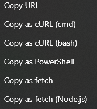
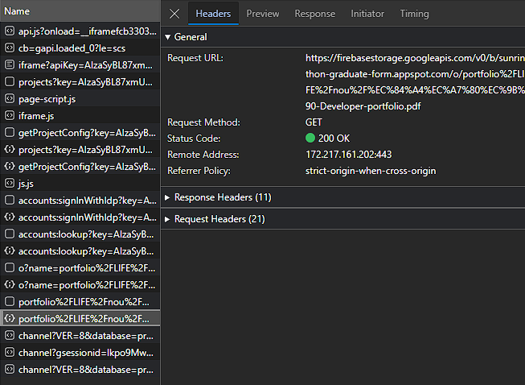

# Overcompensate

## Requirements

폼 제출 완료를 해야하며, 그 상태로 alert를 닫지 말아야 하고, 시작부터 네트워크 탭을 열어야 됨

## Summary

\
을 사용해서
\
의 Request를 복사함

원하는 포트폴리오 pdf를 `portfolio/{생활 -> LIFE, 게임 -> GAME(해보지 않음)}/{팀명}/{이름}-{팀장->Leader, 개발자->Developer, 디자이너->Designer(해보지 않음)}-portfolio.pdf?alt=media`에 정보를 넣고 URL Encoding하여 준비해야 함

아까 Request의 path header를 `/v0/b/sunrinthon-graduate-form.appspot.com/o/{아까 인코딩한 string}`으로 변경하고, request url을 `https://firebasestorage.googleapis.com/v0/b/sunrinthon-graduate-form.appspot.com/o/{아까 인코딩한 string}?alt=media`으로 변경해야 함

이 상태로 request를 보내면 남의 포트폴리오를 가져올 수 있음

# Solution

파일 업로드 시에 파일에 권한을 거는 것도 좋은 방법일 수 있으나, 권한 관련 문제가 생길 수 있음
가장 좋은 방법은 서버리스에서 벗어나서, 서버 운영을 하는 것
