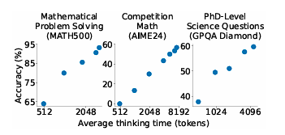
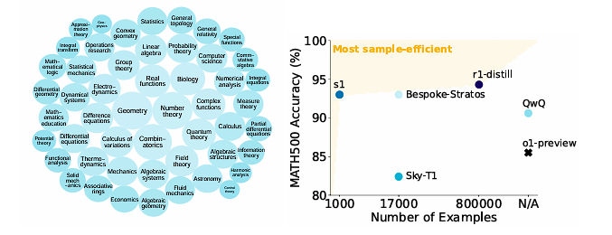

# s1, 간단한 test-time 스케일링

[arxiv](https://arxiv.org/abs/2501.19393)

## 논문 초록 (Abstract)

Test-time scaling은 성능을 향상시키기 위해 추가 test-time 자원(compute)을 사용하는 유망한 언어 모델의 새로운 접근 방식입니다.  
최근, OpenAI의 o1 모델은 이 방식의 능력을 보여주었지만, 공개적으로 방법을 공유하지 않았고, 많은 복제(replication) 시도로 이어지게 되었습니다.  
우리는 test-time scaling과 강력한 추론 성능을 달성하기 위한 간단한 접근 방식을 찾고자 합니다.  
먼저, 우리는 난이도, 다양성, 그리고 품질이라는 세 가지 기준을 기반으로 검증된 소규모 데이터셋 **s1K**를 구축하였고,
여기에는 1,000개의 질문과 추론 과정이 포함되었습니다.  
다음으로, 우리는 예산 강제(budget forcing)를 개발하여 모델의 생각을 강제로 중단하거나
모델이 종료하려고 할 때 모델의 생성 결과(generation)에 “Wait”을 여러 번 추가하는 것으로 생각을 연장시켜 test-time 자원을 제어하였습니다.  
이를 통해 모델이 답변을 재검토하고, 종종 잘못된 추론 단계를 고치게 유도할 수 있습니다.  
Qwen2.5 32B-Instruct을 **s1K**를 사용하여 supervised fine-tuning하였고,
예산 강제를 추가한 결과, 우리의 모델 **s1-32B**는 수학 벤치마크(MATH and AIME24)에서 o1-preview와 비교하여 27%의 성능 향상을 보였습니다.
또한, 예산 강제를 사용한 **s1-32B**의 스케일링을 통해 test-time 개입(intervention) 없이도 성능을 더욱 향상(AIME24: 50% -> 57%)시킬 수 있었습니다.
우리의 모델, 데이터, 그리고 코드는 [https://github.com/simplescaling/s1](https://github.com/simplescaling/s1)에 오픈 소스로 공개되어 있습니다.

## Introduction

지난 몇 년 동안 언어 모델들(LMs)의 성능 향상은
self-supervised pretraining([Ka plan et al., 2020;](https://arxiv.org/pdf/2501.19393#cite.kaplan2020scalinglawsneurallanguage) [Hoffmann et al., 2022](https://arxiv.org/pdf/2501.19393#cite.hoffmann2022trainingcomputeoptimallargelanguage))을
사용하여 train-time 자원을 증가(scaling up)시키는 것에 크게 의존해왔습니다.  
이러한 강력한 모델들의 출현(creation)은 그 위에 구축된 새로운 스케일링 방식인 test-time 스케일링의 기반을 마련(set the stage)했습니다.  
이 방식의 목표는 더 좋은 결과를 얻기 위해 test-time 자원을 증가시키는 것입니다.  
이 방식(idea)를 탐구하는데
많은 연구([Snell et al., 2024;](https://arxiv.org/pdf/2501.19393#cite.snell2024scalingllmtesttimecompute) [Welleck et al., 2024](https://arxiv.org/pdf/2501.19393#cite.welleck2024decodingmetagenerationinferencetimealgorithms))가 진행되었으며,
최근 이 방식의 실효성(viability)이 OpenAI o1([OpenAI, 2024](https://arxiv.org/pdf/2501.19393#cite.o1))에 의해 검증되었습니다.  
o1은 test-time 자원을 증가시켜 일관된 성능 향상을 보이고 강력한 추론 능력을 입증했습니다.  
이 결과는
몬테 카를로 트리 탐색([Gao et al., 2024b;](https://arxiv.org/pdf/2501.19393#cite.gao2024interpretablecontrastivemontecarlo) [Zhang et al., 2024a](https://arxiv.org/pdf/2501.19393#cite.zhang2024o1codero1replicationcoding)),
multi-agent 방식([Qin et al., 2024](https://arxiv.org/pdf/2501.19393#cite.qin2024o1replicationjourneystrategic)),
그리고 다른 방식들([Wang et al., 2024a;](https://arxiv.org/pdf/2501.19393#cite.wang2024drto1optimizeddeepreasoning) [Huang et al., 2024b;](https://arxiv.org/pdf/2501.19393#cite.huang2024o1replicationjourney) [2025](https://arxiv.org/pdf/2501.19393#cite.huang2025o1replicationjourney))과 비슷한 기술에 기반해 모델을 복제하려는 여러 시도로 이어졌습니다.  
그 시도들 중에, DeepSeek R1([DeepSeek-AI et al., 2025](https://arxiv.org/pdf/2501.19393#cite.r1))은 성공적으로 o1과 비슷한 성능을 이끌었고(replicated),
또한 수백만개의 샘플과 여러 개의 훈련 과정을 사용한 강화 학습을 사용했습니다.  
그러나, 많은 복제 시도에도 불구하고, 아무 시도도 공개적으로 test-time scaling의 행동을 명확하게 복제하지 못하였습니다.  
따라서, 우리는 질문했습니다: test-time scaling과 강력한 추론 능력을 얻는 가장 간단한 접근 방식은 무엇인가?  
우리는 예산 강제라고 부르는 간단한 test-time 기술을 이용한 추론 시간 제어와 다음 토큰 예상을 포함한 1000개의 샘플만을 이용해 훈련하였고,
그것은 test-time 자원과 비례하여 성능을 향상시키는 강력한 추론 모델로 이끌었습니다.  
구체적으로는, 우리는 1000개의 신중하게 선별된 질문과 Gemini Thinking Experimental([Google, 2024](https://arxiv.org/pdf/2501.19393#cite.geminithinking))에서 증류된 추론 기록(traces)과 답으로 구성된 **s1K**를 구축했습니다.  
우리는 16개의 H100을 이용하여 26분만에 훈련이 가능한 작은 데이터셋을 이용해 미리 훈련된 모델에서 supervised fine-tuning하였습니다.  
훈련 후, 우리는 예산 강제를 이용해 test-time 자원의 소비량을 제어했습니다:  
**(I)** 만약 모델이 의도된 토큰보다 더 많은 생각 토큰을 생성한다면, end-of-thinking 토큰을 추가해 강제로 생각 프로세스를 멈춥니다.  
이런 방식으로 멈추면 모델이 답변을 생성하는 단계로 전환됩니다.  
**(II)** 만약 모델이 더 많은 test-time 자원을 소비하기를 원한다면, 더 많은 탐험으로 유도하기(encourage) 위해
end-of-thinking 토큰의 생성을 무시(suppress)하고, 대신 "Wait"을 현재 모델의 추론 과정에 추가합니다.  
> 

> *그림 1.* **s1-32B를 이용한 test-time 스케일링.**  
우리는 **s1-32B**를 추론-집약적인 일을 벤치마크하였고, test-time 자원에 변화를 주었습니다.

> 

> *그림 2.* **s1K와 s1-32B**.  
> (왼쪽) **s1K**는 1000개의 고품질, 다양하고, 어려운 질문과 추론 과정이 포함된 데이터셋입니다.  
> (오른쪽) **s1-32B**, **s1K**로 파인튜닝된 32B 파라미터 모델은 가장 샘플-효율적입니다. (is on the sample-efficiency frontier.) 다른 모델들을 보려면 [Table 1(미번역)](https://arxiv.org/pdf/2501.19393#table.caption.5)을 참조해주세요.

1000개의 샘플을 이용한 간단한 SFT(supervised fine-tuning) 레시피(s1K)와 모델에 test-time 예산 강제를 한 **s1-32B**는 test-time scaling(의 성능)을 나타내었습니다. ([그림 1](#figure1))  
더 나아가서, **s1-32B**는 가장 샘플-효율적인 추론 모델이고 OpenAI의 o1-preview 같은 closed-source 모델을 넘어섰습니다. ([그림 2](#figure2))  

우리는 (a) 우리의 1000개의 추론 샘플들과 (b) 우리의 test-time scaling에 대한 광범위한 제거(ablation) 실험을 수행했습니다.  
**(a)** 의 경우, 우리는 난이도, 다양성, 그리고 품질의 측정을 우리의 선택 알고리즘에 통합하는 것이 중요하다는 것을 발견했습니다.  
무작위 선택, 가장 긴 추론 기록을 가진 샘플 선택, 또는 가장 다양한 샘플들을 선택하는 것은 모두 상당히 나쁜 성능으로 직결됩니다. (AIME24에서 평균 -30% 내외)  
우리의 59000개의 모든 데이터셋(data pool)(**s1K**의 superset)으로 훈련하는 것은 1000개의 샘플(**s1K**)에 비해서 많은 이점을 제공하지 않았습니다.  
이것은 신중한 데이터 선택의 중요성을 강조하며, instruction tuning에 대한 이전 연구와 일치합니다. ([Zhou et al., 2023](https://arxiv.org/pdf/2501.19393#cite.zhou2023lima))  
**(b)** 의 경우, 우리는 접근 방식들을 비교하기 위해 test-time scaling에 대한 요구사항(desiderata)을 정의했습니다.  
예산 강제는 완벽한 제어 가능성과 명확한 긍정적인 기울기로 강력한 성능으로 이끌었고, 이 결과는 최상의 확장으로 이어졌습니다.  

요약해서 말하자면, 우리의 기여는:
우리는 샘플-효율적인 추론 데이터셋 ([§2](#s1k를-만들기-위한-추론-데이터-선별))과 test-time scaling([§3 (미번역)](https://arxiv.org/pdf/2501.19393#section.3))을 위한 간단한 방법을 개발했습니다.;
우리가 만든 **s1-32B**, o1-preview과 경쟁 가능한 모델에 기반해서, ([§4 (미번역)](https://arxiv.org/pdf/2501.19393#section.4))
데이터 ([§5.1 (미번역)](https://arxiv.org/pdf/2501.19393#subsection.5.1)) 와 test-time scaling([§5.2 (미번역)](https://arxiv.org/pdf/2501.19393#subsection.5.2))의 미묘한 점들을 제거하였습니다.  
우리는 간단한 추론에 대한 향후 연구의 동기를 부여하는 논의로 마무리합니다.  
우리의 코드, 모델, 그리고 데이터는 [https://github.com/simplescaling/s1](https://github.com/simplescaling/s1)에 오픈소스로 공개되어 있습니다.

# s1K를 만들기 위한 추론 데이터 선별

이 부분에선, 우리는 큰 데이터셋을 만드는 과정[§2.1](#59000개의-초기-데이터셋collection)과 그 후, **s1K**로 필터링하는 과정[§2.2 (미번역)](https://arxiv.org/pdf/2501.19393#subsection.2.2)을 서술합니다.

## 59000개의 초기 데이터셋(collection)

우리는 세 개의 지침 원칙을 기준으로 16개의 다양한 출처(sources)에서 초기 (데이터셋의) 59029개의 질문들을 수집했습니다.  
**품질**: 데이터셋은 높은 품질을 가져야 합니다;
우리는 항상 샘플을 심사하고, 안 좋은 formatting등을 가진 데이터셋들을 무시해야 합니다.  
**난이도**: 데이터셋은 힘들어야(challenging) 하고, 많은 추론 노력을 필요로 해야합니다.  
**다양성**: 데이터셋은 다른 추론 작업들을 다루기(cover) 위해 다양한 분야에서 나와야(stem) 합니다.  
이런 기준들을 기반으로 우리의 데이터셋을 51181개의 예시로 줄였습니다.  
이 예시들에서 우리는 고품질이고 추가 필터링이 필요하지 않다고 판단되는 데이터셋들로부터 최종 데이터셋을 위한 384개의 샘플을 식별(identify)했습니다. (자세한 내용은 [§B.4](https://arxiv.org/pdf/2501.19393#subsection.B.4) 참조).

**기존 데이터셋의 curation** 우리의 가장 큰 출처(source)는 온라인 웹사이트에서 가져온 30660개의 수학 문제를 가진 NuminaMATH
([LI et al., 2024](https://arxiv.org/pdf/2501.19393#cite.numina_math_datasets))입니다.  
또한, 우리는 (역사적인(historical)?) AIME의 문제들을 포함했습니다.  
다양성을 늘리기 위해, 우리는 다양한 Olympiad들에서 천문학, 생물학, 화학, 컴퓨터 과학, 지리, 수학, 그리고 물리학을 아우르는 문제들을 가진 OlympicArena
([Huang et al., 2024a](https://arxiv.org/pdf/2501.19393#cite.huang2024olympicarenabenchmarkingmultidisciplinecognitive))
를 사용했습니다.  
OmniMath ([Gao et al., 2024a](https://arxiv.org/pdf/2501.19393#cite.gao2024omnimathuniversalolympiadlevel))
는 4238개의 competition(대회/경쟁) 수준의 수학 문제를 추가했습니다.  
또한, 우리는 영어, 법, 그리고 논리를 다루는 SAT, LSAT같은 테스트들의 문제를 가진(features) AGIEval
([Zhong et al., 2023](https://arxiv.org/pdf/2501.19393#cite.zhong2023agievalhumancentricbenchmarkevaluating))
에서 2385개의 문제를 추가했습니다.  
우리의 다른 출처들은 [Table 6 (미번역)](https://arxiv.org/pdf/2501.19393#table.caption.17)의
[§B (미번역)](https://arxiv.org/pdf/2501.19393#appendix.B)를 참조하십시오.  

**정량적 추론의 새로운 데이터셋** 현존하는 데이터셋을 보완하기 위해, 우리는 새로운 (원본(original)) 데이터셋을 만들었습니다.  
s1-prob는 스탠포드 대학교의 통계학과의 박사 자격 시험의 확률 섹션
([https://statistics.stanford.edu](https://statistics.stanford.edu))
에서 가져온 182개의 어려운 증명들을 다루는 문제와 손으로 써진 답들로 구성되어 있습니다.  
자격 시험의 확률 섹션은 매년 열리고 전문적인 수학 풀이 능력을 필요로 합니다.  
s1-teasers는 quantitative 투자를 하는 직업(position)의 인터뷰 질문으로 흔히 사용되는 23개의 도전적인 (난이도의) brain-teaser를 포함합니다.  
각각의 샘플은 PuzzledQuant([https://www.puzzledquant.com](https://www.puzzledquant.com))에서 가져온 문제와 답으로 구성되어 있습니다.  
우리는 가장 높은 난이도의 레벨 (어려움)을 가진 난이도의 문제(example)들만 가져왔습니다.  
각각의 질문들에 대해, 우리는 Google Gemini Flash Thinking API
([Google, 2024](https://arxiv.org/pdf/2501.19393#cite.geminithinking))
를 사용해 추론 과정과 정답을 추출했습니다.  
이것은 59000개의 질문, 추론 과정, 정답(의 쌍)을 산출했습니다.  
우리의 데이터셋의 예시들은 [§C.2](https://arxiv.org/pdf/2501.19393#subsection.C.2)에 존재합니다.  
우리는 (실행) 질문들 (MATH500, GPQA Diamond, AIME24; [§B.5](https://arxiv.org/pdf/2501.19393#subsection.B.5))
에 대해 8-grams와 데이터 중복 제거를 통해 샘플들을 정화(decontaminate)했습니다.

## 1000개의 마지막 샘플 선택

**난이도** 난이도의 경우, 우리는 두 가지의 기준을 세웠습니다: 모델 성능과 추론 기록 길이.  
우리는 각각의 질문마다 두개의 모델을 실행했습니다:
Qwen2.5-7B-Instruct와 Qwen2.5-32B-Instruct ([Qwen et al., 2024](https://arxiv.org/pdf/2501.19393#cite.qwen2024qwen25technicalreport)),
정확성은 Claude 3.5 Sonnet이 각각의 시도를 정답(reference solution)과 비교하여 평가했습니다.  
우리는 Qwen2.5 tokenizer를 이용해 각각의 추론 기록의 길이를 측정하여 문제의 난이도를 평가하였습니다.  
이것은 더 어려운 문제일수록, 더 많은 추론 토큰이 필요하다는 가정을 기반으로 합니다.  
이 (난이도) 평가를 기반으로, 우리는 Qwen-2.5-7B-Instruct와 Qwen2.5-32B-Instruct가 정확하게 풀 수 있기 때문에, 너무 쉬울 수 있는 문제로 간주하고 제거했습니다.  
두 모델들을 사용함으로써, 우리는 모델들 중 하나의 모델의 드문 실수로 인해 쉬운 샘플이 우리의 필터링을 통과하는 것의 가능성을 줄였습니다.  
이것은 우리의 전체 샘플을 24496개로 줄였고, 다양성을 기반으로 한 다음 subsampling을 위한 기반을 마련했습니다.  
이 필터링은 Qwen2.5-32B-Instruct를 사용하여 미세 조정할 예정이므로 필터링에 최적화되어 있을 수 있지만, 모델 기반 필터링의 개념은 다른 설정에도 일반화됩니다.
